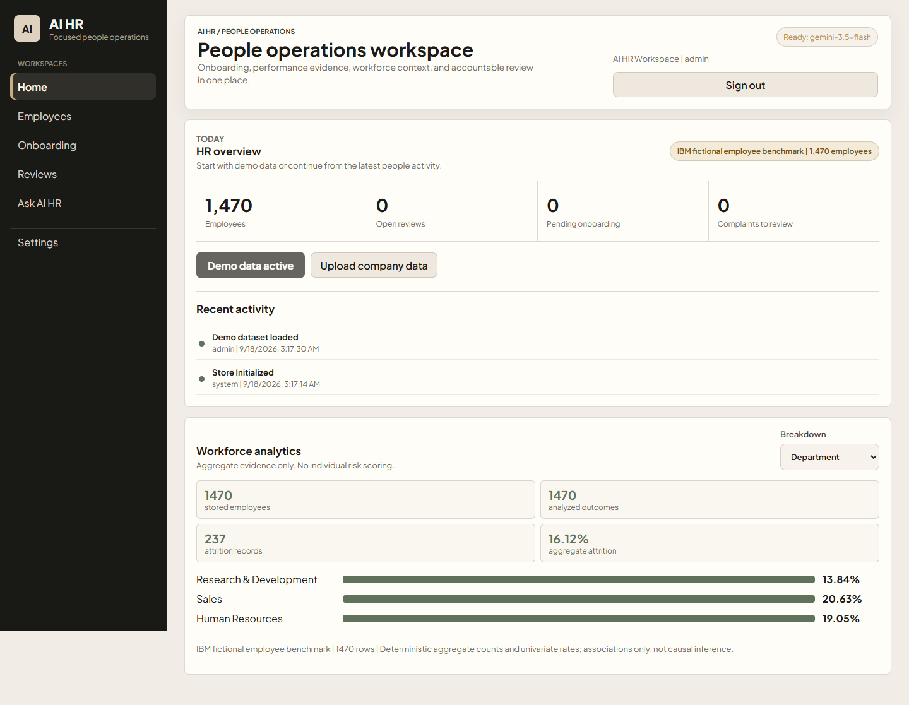

# AI HR



AI HR is a Gemini-powered HR copilot that organizes employee information, prepares routine HR work, and keeps important employment decisions under accountable human control. It combines a focused hackathon-ready interface with grounded aggregate analytics, documented performance reviews, secure accounts, PostgreSQL persistence, approval gates, audit trails, privacy operations, and deployable infrastructure.

The product interface has five focused workspaces:

- **Home** for employee counts, open reviews, onboarding, complaints, activity, and clearly labeled demo data.
- **Employees** for a searchable directory, unified profiles, CSV/JSON imports, performance history, feedback, pending actions, and audit timelines.
- **Onboarding** for generated role descriptions, first-week schedules, access checklists, practical office guidance, completion tracking, copy, and PDF export.
- **Reviews** for performance evidence, employee timeline records, fair next-action briefs, confirmation gates, human approval, and PDF export.
- **Ask AI HR** for everyday questions, drafts, plans, and explanations.

Imports, company knowledge, audit logs, access, privacy, integrations, and launch controls live in **Settings**. Legacy record types and recruiter accounts remain readable by the backend for migration compatibility but are not offered as new core workflows.

## Run Locally

Create `.env` from `.env.example`, set `GEMINI_API_KEY`, then start:

```powershell
node server.js
```

If Node is not on PATH in Codex Desktop:

```powershell
& "C:\Users\LENOVO\.cache\codex-runtimes\codex-primary-runtime\dependencies\node\bin\node.exe" server.js
```

Open `http://localhost:3000`.

Without `DATABASE_URL`, local development uses `data/hr-store.json`. Production must set `DATABASE_URL` and will create the PostgreSQL schema automatically.

## Backend Features

- Gemini HR assistant endpoint with timeout handling.
- HR record storage for employees, candidates, jobs, policies, cases, and tasks.
- Decision brief engine with high-impact risk classification.
- Approval workflow for sensitive decisions.
- Audit log with basic PII redaction.
- Role tokens for admin, HR manager, recruiter, employee, and auditor.
- Rate limiting for normal API and AI endpoints.
- Security headers, readiness checks, and Docker support.
- Transactional PostgreSQL storage with concurrent-write protection.
- Per-deployment organization isolation through `AIHR_ORGANIZATION_ID`.
- First-administrator setup, password login, secure HTTP-only sessions, logout, and user disable controls.
- Expiring invitation links, invitation acceptance, and self-service password rotation with session revocation.
- Authenticator-app MFA with challenge login, self-service enrollment/disable, and administrator recovery.
- Optional SMTP invitation delivery and signed HTTPS incident alerts.
- Searchable records with edit, soft deletion, organization export, and retention purge.
- Deleted-record restoration and explicit approve/reject outcomes for human decision review.
- Paginated audit access, operational metrics, and structured production request logs.
- CI verification for authentication and PostgreSQL restart persistence.
- Encrypted PostgreSQL application backups with authenticated restore safeguards.
- Deterministic workforce analytics with provenance, protected-field exclusion, and no individual risk scoring.
- Performance tracking for goals, documented evidence, support, outcomes, and follow-up status, with no automated termination ranking.
- Employee timelines for factual shout-outs, complaints, and observations, with complaint review status and no individual behavior score.
- A unified employee profile joining employment facts, reviews, wins, concerns, complaints, pending actions, and an activity timeline.
- A home dashboard with active-dataset labeling, demo-data loading, operating counts, and recent activity.
- Onboarding-pack persistence, completion status, and downloadable onboarding and performance PDF reports.
- A Dataset Manager with CSV/JSON preview, 1,000-row batching, exact-duplicate skipping, rejected-row summaries, protected-column exclusion, and immediate directory/analytics refresh.
- Internal policy/document retrieval with source labels and automated unsupported-claim warnings.
- Scheduled workflows and signed HTTPS adapters for calendar, HRIS, ATS, collaboration, and payroll notifications.
- Launch-readiness attestations, terms acknowledgement, and AI-impact templates.

## First Administrator

When `AIHR_AUTH_REQUIRED=true` and no account exists, the frontend shows **Create workspace**. Enter the organization name, administrator email, and a password of at least 12 characters with uppercase, lowercase, and numeric characters. Later administrators can create expiring invitation links, create direct accounts, and disable role-based accounts from Access management.

Passwords use Node's `scrypt`; only salted hashes are stored. Browser sessions use HTTP-only, SameSite cookies. Production cookies are Secure and the server enables HSTS.

## Important Product Boundary

This product can automate HR operations, draft decisions, classify risk, and prepare decision briefs. For market launch, high-impact decisions such as hiring/rejection, firing, compensation, discipline, protected-class matters, leave, payroll, immigration, harassment, discrimination, retaliation, safety, and union issues must keep accountable human review.

## Production Mode

Set:

```env
AIHR_AUTH_REQUIRED=true
AIHR_ADMIN_TOKEN=long-random-token
AIHR_HR_MANAGER_TOKEN=long-random-token
AIHR_RECRUITER_TOKEN=long-random-token
AIHR_EMPLOYEE_TOKEN=long-random-token
AIHR_AUDITOR_TOKEN=long-random-token
```

Paste the relevant token into the frontend Access token field.

## Local PostgreSQL With Docker

```powershell
docker compose up --build
```

Docker Compose starts both AI HR and PostgreSQL, imports existing JSON records into an empty database, and persists the database in a named volume.

## Deploy On Render

1. Rotate the Gemini key that was previously shared in chat, then put the new key only in your password manager.
2. Create a private GitHub repository and push this project.
3. In Render, choose **New > Blueprint** and connect the repository.
4. Render reads `render.yaml`, creates the web service and a private PostgreSQL database, and asks for `GEMINI_API_KEY`.
5. After deploy, open the service's `onrender.com` URL.
6. In the Render service environment page, reveal the generated role token you want to use and paste it into the app's Access token field.
7. Render's service URL is detected automatically. For a custom domain, set both `AIHR_ALLOWED_ORIGIN` and `AIHR_APP_BASE_URL` to its full `https://` origin.
8. Configure SMTP and an alert webhook from `.env.example` before inviting production users.

The Blueprint uses paid starter web and database plans because an HR system should not depend on sleeping services or disposable storage. Review current Render pricing before provisioning.

## Existing Data Migration

Set `DATABASE_URL` and temporarily set `AIHR_IMPORT_JSON=true`. The server imports `data/hr-store.json` only when the PostgreSQL organization store is empty. Set it back to `false` after the first successful start.

## Full Workflow Test

The repository includes IBM's fictional employee attrition dataset at `datasets/ibm-employee-attrition.csv`. It contains 1,470 synthetic rows and comes from IBM's `employee-attrition-aif360` repository under the dataset licenses documented there.

With the app running, execute:

```powershell
npm run test:e2e
```

For a disposable workspace that cannot alter live HR data, execute `npm run test:e2e:isolated` instead. The isolated test uses a deterministic local AI response, so CI does not send data to Gemini or fail because of provider demand.

The test imports the dataset, exercises all record types, eight AI HR specialties, eight decision workflows, approval gates, risk classification, validation, metrics, and audit logging. It writes a machine-readable report to `test-results/full-e2e-report.json`.

Core verification does not call Gemini:

```powershell
npm test
```

Before a release or GitHub push, run the complete local gate:

```powershell
npm run release:check
```

It tests syntax, isolated local storage, bootstrap, invitations, password rotation, MFA, grounded analytics, claim validation, knowledge retrieval, schedules, readiness controls, role denial, session revocation, record lifecycle, privacy operations, decision review, backup integrity, alerts, audit pagination, and PostgreSQL when `DATABASE_URL` is available. GitHub Actions provisions PostgreSQL automatically for CI.

## Hackathon Demo

Use [docs/HACKATHON-DEMO.md](docs/HACKATHON-DEMO.md) for the three-minute click path and presenter notes. The ready-to-present deck is [artifacts/AI-HR-Hackathon-Pitch.pptx](artifacts/AI-HR-Hackathon-Pitch.pptx).

## Operations

- Deployment and recovery: `docs/operations-runbook.md`
- Security and privacy: `docs/security-privacy.md`
- Remaining launch requirements: `docs/production-readiness.md`
- GitHub and deployment steps: `docs/GITHUB-RELEASE.md`
- Bundled fictional dataset terms: `docs/DATASET-NOTICE.md`
- Vulnerability reporting: `SECURITY.md`

## Repository Safety

The local `.env`, JSON database, backups, logs, generated test results, dependencies, and Codex working files are excluded from Git. Rotate any API key that has been pasted into chat, a screenshot, terminal output, or another untrusted location before deployment. Create the first GitHub repository as private and choose a software license before making it public.
